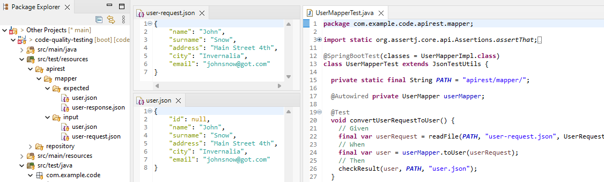
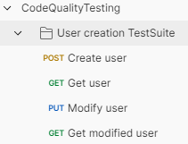
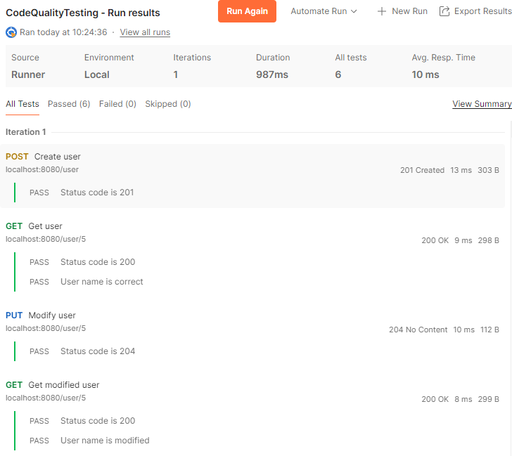

# Calidad, tests y gestión de deuda técnica


## ¿Qué vamos a ver?

A lo largo de mi carrera profesional trabajar en diferentes proyectos me ha proporcionado una visión clara sobre diferentes conceptos básicos para que un proyecto y un equipo funcione bien tecnicamente. 

A continuación y a modo de recopilatorio iré desgranandolos punto a punto y con ejemplos desde una perspectiva de desarrollo:

## <a name="index">Índice</a>

- [Organización del código](#code-organization)
- [Nomenclaturas](#code-naming)
- [Formato del código](#code-format)
- [Tests](#tests)
    * [Tests unitarios](#unit-tests)
      + Instancio
      + Json Unit test
      + Jacoco pluging % coverage
      + Test de mutación
      + Test threadSafe
    * [Tests integración](#integration-tests)
      + Dependencias embebidas
      + Test-container
    * [Tests e2e](#e2e-tests)
      + Postman
- [Análisis estático](#static-analysis)
- [Seguridad en las dependencias](#dependency-security)
- [Equipo, equipo y equipo](#team)

### Requisitos
- Hardware: Intel Core i7, 16Gb RAM
- Spring Boot 3
- SonarQube

## <a name="code-organization">Organización del código</a> [&#8593;](#index)

La organización del código desde mi punto de vista es algo fundamental en todo proyecto. Proporciona orden, coherencia y facilidad de búsqueda a la hora de encontrar el código de una funcionalidad concreta.
Una estrategia con la que he visto grandes resultados es la seguida por la arquitectura hexagonal: separación por capas ( puertos - adaptadores - aplicación - dominio, o alguna de sus variantes). Saber en cual de estos niveles se está realizando una modificación de código es vital para que un proyecto no se descontrole al cabo del tiempo. La peor sensación como desarrollador es sentir que trabajas en el caos.

## <a name="code-naming">Nomenclaturas</a> [&#8593;](#index)

Otra de las premisas trata de cómo nombrar clases, variables, métodos, paquetería, etc. Para ello puede ayudar seguir estándares como por ejemplo el de [Oracle](https://www.oracle.com/java/technologies/javase/codeconventions-namingconventions.html).

## <a name="code-format">Formato del código</a> [&#8593;](#index)

Aunque no es algo fundamental, resulta de gran ayuda mantener un mismo formato en todo el código redactado (espaciado, máximo de caracteres por linea, ordenación de imports, etc.). Esta homogeneidad, al igual que en el punto anterior, proporciona claridad en los textos.
Para ello existen diferentes formas de llevarlo a cabo: individualmente mediante configuración de cada IDE mediante 'settings' y 'plugins' como [google-plugin](https://plugins.jetbrains.com/plugin/8527-google-java-format), aunque es posible que alinear IDEs de diferente tipo resulte complicado) o mediante algún plugin de maven (que resulte genérico para todos). 
En este proyecto he utilizado el plugin `googleformatter-maven-plugin` basado en un estandar de Google que permite corregir estos aspectos una vez se ejecute `mvn install`, pero sin aplicar ningún cambio dentro del código productivo.

## <a name="tests">Tests</a> [&#8593;](#index)


No hace falta decir que algo fundamental en un proyecto software es que éste sea testeable. Y cuando me refiero a esto, quiero decir de forma automática.

A lo largo de mi carrera he trabajado en diferentes proyectos y en algunos de ellos no se tenían tests automáticos o estos eran muy escasos. El resultado fue desperdiciar infinidad de horas probando manualmente y de forma recurrente una funcionalidad que se desarrolló hace meses cada vez que se iba a subir un cambio a producción, descubrir que un error que ya corregiste vuelve a reproducirse o incluso he visto cerrarse proyectos enteros por esta razón. Las prisas por subir nuevas funcionalidades y la presión de algunos stakeholders que no dan importancia a este tema provocan que al final no se realicen tests, sean pobres o de mala calidad. Sin embargo, es nuestra responsabilidad como desarrolladores (y no digo que sea fácil) luchar para hacer las cosas bien. Y esto debería cumplirse independientemente que tengamos o no a mano compañeros especializados de QA. La entrega de un código no debería ser dependiente a otros. Los desarrolladores debemos estar seguros que el código que entregamos funciona y funcionará de forma correcta.

### <a name="unit-tests">Tests unitarios</a> [&#8593;](#index)

Tener un framework que agilice la generación de tests unitarios es muy útil para mantener esta dinámica. Además de tecnologías conocidas como JUnit y Mockito voy a mencionar dos sistemas para generar datos de prueba que me han beneficiado mucho en el pasado:

#### Instancio

Se trata de una librería que genera de forma rápida y aleatoria datos para nuestros POJOs/DTOs cuando no es relevante el contenido de los mismos.

#### Json unit test

Este otro caso es un método que se apoya en librerías de Json para generar objetos de prueba y comprobar/comparar el contenido de los mismos. Es muy útil cuando tenemos que tener controlados los datos que vamos a utilizar, reduce drásticamente el código necesario para preparar el test y permite realizar comparaciones estrictas sobre un objeto esperado sin necesidad de chequear atributo a atributo.



#### Jacoco pluging % coverage

Este plugin de maven nos ayuda a no olvidarnos de realizar tests unitarios. Tras lanzar el comando `mvn install`, se detecta el nivel de cobertura sobre el nuevo código y lanza una alerta si no se llega al mínimo que hemos estipulado. Si la dinámica dentro del equipo de desarrollo es no subir código sin sus tests (es decir, todo en el mismo commit), este plugin es de gran ayuda.


#### Test de mutación

Una de las debilidades más importantes de un test unitario es que al modificar el código, el test siga pasando sin más. Algo debería avisarnos de que el comportamiento ha cambiado, ¿no es así?.
Por ello existen herramientas como los test de mutación que nos ayudan a desarrollar tests más robustos.

```
mvn -DwithHistory test-compile org.pitest:pitest-maven:mutationCoverage
```

En el informe que se genera al lanzar el pluging de maven se indica cómo de buenos son nuestros tests, su robustez y, en caso de que haga falta, qué nos faltaría comprobar.

> */target/pit-reports/index.html*


### <a name="integration-tests">Tests de integración</a> [&#8593;](#index)

Aunque parezca que con unos buenos tests unitarios tenemos nuestra aplicación asegurada, nada más lejos de la realidad. Que cada pieza por separado funcione bien no garantiza que al unirlas el resultado sea el mismo.


#### Dependencias embebidas

Uno de los primeros escenarios a implantar es la incorporación de dependencias embebidas a nuestros test de integración. Bases de datos en memoria o brokers de mensajes embebidos pueden ayudarnos a comprobar que el comportamiento de nuestro sistema es correcto.

#### Test-container

Un escenario más avanzado y óptimo sería utilizar la misma base de datos y el mismo brocker de mensaje que utilizaremos en la realidad. Para ello es posible implementar test de integración en los que se desplieguen contenedores durante las pruebas y se apaguen cuando éstas terminen. Son los llamados test containers. El único requisito es tener correctamente configurado un gestor de contenedores como puede ser Docker.

### <a name="e2e-tests">Tests e2e</a> [&#8593;](#index)

Aún teniendo un equipo de calidad/QA/QE que posteriormente compruebe los desarrollos, siempre es recomendable unas pruebas globales para estar seguro de que no se nos olvida nada. Para ello herramientas como Postman puede ser de gran ayuda para chequear un 'journey' en el que intervengan diferentes pasos.





## <a name="static-analysis">Análisis estático</a> [&#8593;](#index)

Los analizadores estáticos son una herramienta muy útil a la hora de mantener un código limpio y de calidad. Éstos sirven de dashboard para visibilizar métricas sobre 'smells', vulnerabilidades, cobertura, código duplicado, etc. En caso de que el CI/CD de tu proyecto no tenga ninguno integrado es posible desplegarlo con unas sencillas reglas por defecto sobre un contenedor docker. En este caso utilizaremos el conocido SonarQube.

Al lanzar el siguiente comando maven enviaremos el reporte al servidor.

```
mvn sonar:sonar -Dsonar.user=admin -Dsonar.password=admin
```

> *http://localhost:9000 -> U: admin - P: admin*


## <a name="team">Equipo, equipo y equipo</a> [&#8593;](#index)

Ninguno de estos puntos anteriores tiene sentido si cada miembro del equipo trabaja de manera independiente. Llegar a acuerdos para trabajar uniformemente es crítico para un proyecto. De lo contrario podremos encontrarnos con proyectos Frankensteins en los que cada fichero está hecho de una forma diferente según quien lo hiciese. Esto además ralentiza los desarrollos, la búsqueda de errores y su mantenimiento.
Por lo tanto, una vez se componga un equipo o cuando un nuevo miembro se integre al mismo deberá dejarse claro cuales son las normas internas a seguir. Si es necesario es mejor discutir alguna que resulte controvertida antes que encontrarnos sorpresas o futuros roces entre compañeros.

## Bibliografía

- [Arquitectura hexagonal](https://www.geeksforgeeks.org/hexagonal-architecture-in-java/)
- [Oracle code naming conventions](https://www.oracle.com/java/technologies/javase/codeconventions-namingconventions.html)
- [Mutation tests](https://pitest.org/)
- [Testcontainers con Spring Boot](https://www.baeldung.com/spring-boot-testcontainers-integration-test)
- [Postman e2e tests](https://blog.postman.com/writing-automated-tests-for-apis-using-postman/)
- [Sonarqube](https://www.sonarsource.com/products/sonarqube/)
