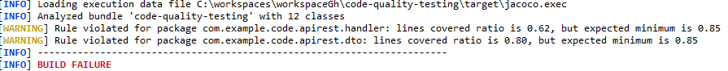
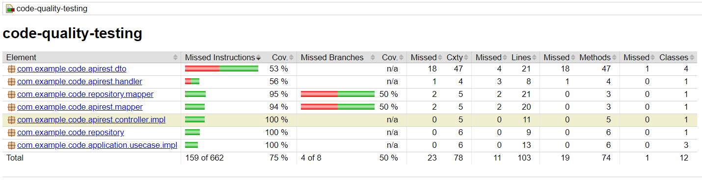
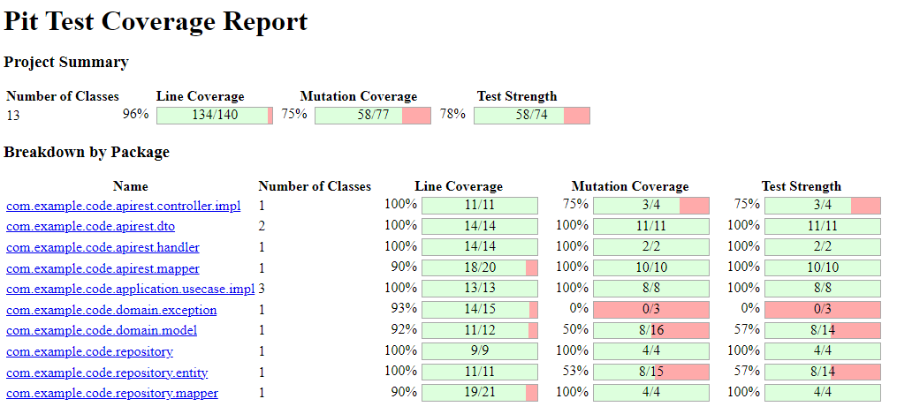
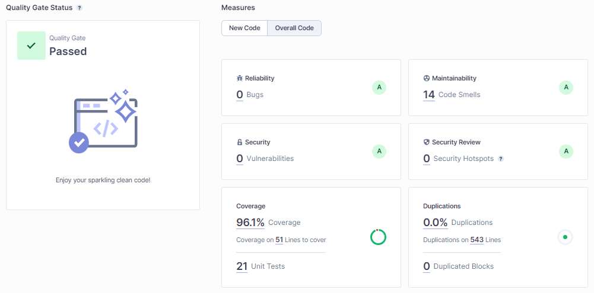

# Calidad y tests de tu código

## ¿Qué vamos a ver?

A lo largo de mi carrera profesional he ido trabajando en diferentes proyectos que me han proporcionado una visión clara de qué es básico y qué no para que un proyecto y un equipo funcione tecnicamente bien. A continuación y a modo de recopilatorio iremos desgranando punto a punto.

## <a name="index">Índice</a>

- [Hexagonal architecture](#hex-architecture)
- [Formato del código](#code-format)
- [Test unitarios](#unit-tests)
    * Json Unit test vs Instancio
    * Jacoco pluging % coverage
    * Test de mutación
    * Test threadSafe
- [Test integración](#int-tests)
    * Dependencias Embebido
    * Test-container
- [Test e2e](#e2e-tests)
    * Postman
- [Análisis estático](#static-analysis)
- [Seguridad en las dependencias](#dependency-security)

### Requisitos
- Hardware: Intel Core i7, 16Gb RAM
- Docker v19.03.5?
- Spring Boot 3
- SonarQube

## <a name="hex-architecture">Hexagonal architecture vs DDD</a> [&#8593;](#index)

## <a name="code-format">Formato del código</a> [&#8593;](#index)

## <a name="unit-tests">Test unitarios</a> [&#8593;](#index)

### Json Unit test vs Instancio

### Jacoco pluging % coverage

### Test de mutación

### Test threadSafe

## <a name="int-tests">Test de integración</a> [&#8593;](#index)

### Dependencias Embebido

### Test-container

## <a name="e2e-tests">Test e2e</a> [&#8593;](#index)

## <a name="static-analysis">Análisis estático</a> [&#8593;](#index)

## <a name="dependency-security">Seguridad en las dependencias</a> [&#8593;](#index)
