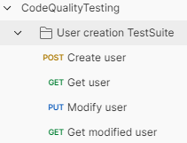

# Quality, Tests, and Technical Debt Management

*Read this document in [Spanish](https://github.com/peterm85/code-quality-testing/blob/master/README.md)*

## What’s this all about?

Throughout my professional career, working on different projects has given me a clear understanding of various basic concepts for a project and a team to function well technically.

Below, as a compilation, I will break them down point by point with examples from a development perspective:

## <a name="index">Index</a>

- [Code Organization](#code-organization)
- [Naming Conventions](#code-naming)
- [Code Formatting](#code-format)
- [Tests](#tests)
    * [Unit Tests](#unit-tests)
        + Instancio
        + Json Unit Test
        + Jacoco Plugin % Coverage
        + Mutation Testing
    * [Integration Tests](#integration-tests)
        + Embedded Dependencies
        + Test Containers
    * [E2E Tests](#e2e-tests)
        + Postman
- [Static Analysis](#static-analysis)
- [Team, Team, and Team](#team)
- [Bibliography](#bibliography)

## <a name="code-organization">Code Organization</a> [&#8593;](#index)

From my point of view, code organization is fundamental in any project. It provides order, consistency, and ease of finding specific functionality.
One strategy that has shown great results is the one followed by hexagonal architecture: separation by layers (ports - adapters - application - domain, or some of its variants). Knowing at which of these levels a code modification is being made is vital to prevent a project from spiraling out of control over time. The worst feeling as a developer is working in chaos.

## <a name="code-naming">Naming Conventions</a> [&#8593;](#index)

Another premise is how to name classes, variables, methods, packages, etc. Following standards like [Oracle's](https://www.oracle.com/java/technologies/javase/codeconventions-namingconventions.html) can help.

## <a name="code-format">Code Formatting</a> [&#8593;](#index)

Although not fundamental, maintaining the same format throughout the code (spacing, maximum characters per line, import ordering, etc.) is very helpful. This uniformity, like in the previous point, provides clarity in the texts.
There are different ways to achieve this: individually configuring each IDE through 'settings' and 'plugins' like [google-plugin](https://plugins.jetbrains.com/plugin/8527-google-java-format). However, aligning different types of IDEs can be challenging. Another option is using a Maven plugin (which is generic for everyone).
In this project, I used the `googleformatter-maven-plugin` based on a Google standard that corrects these aspects once `mvn install` is executed, without applying any changes to the production code.

## <a name="tests">Tests</a> [&#8593;](#index)


It goes without saying that something fundamental in a software project is that it is testable. And by this, I mean automatically.

Throughout my career, I have worked on different projects, and in some of them, there were no automated tests, or they were very scarce. The result was wasting countless hours manually testing functionality developed months ago every time a change was about to be deployed to production, discovering that a previously fixed error reappeared, or even seeing entire projects shut down for this reason. The rush to release new features and the pressure from some stakeholders who do not value this topic lead to a lack of tests, poor tests, or low-quality tests. However, it is our responsibility as developers (and I am not saying it is easy) to fight to do things right. This should be fulfilled regardless of whether or not we have QA specialists on hand. Delivering code should not depend on others. Developers must ensure that the code we deliver works and will work correctly.

### <a name="unit-tests">Unit Tests</a> [&#8593;](#index)

Having a framework that streamlines the generation of unit tests is very useful for maintaining this dynamic. In addition to well-known technologies like JUnit and Mockito, I will mention two systems for generating test data that have greatly benefited me in the past:

#### Instancio

This is a library that quickly and randomly generates data for our POJOs/DTOs when the content of the data is not relevant.

#### Json Unit Test

This method relies on JSON libraries to generate test objects and check/compare their content. It is very useful when we need to control the data we will use, drastically reduces the code needed to prepare the test, and allows strict comparisons of an expected object without checking attribute by attribute.


#### Jacoco Plugin % Coverage

This Maven plugin helps ensure we do not forget to write unit tests. After running the `mvn install` command, it detects the coverage level of the new code and raises an alert if the minimum threshold is not met. If the team's dynamic is not to push code without its tests (i.e., everything in the same commit), this plugin is very helpful.


#### Mutation Testing

One of the most significant weaknesses of a unit test is that modifying the code allows the test to pass without issue. Something should alert us that the behavior has changed, right?
For this reason, tools like mutation testing help us develop more robust tests.

```
mvn -DwithHistory test-compile org.pitest:pitest-maven:mutationCoverage
```

The report generated by running the Maven plugin indicates how good our tests are, their robustness, and, if necessary, what we need to check.

> */target/pit-reports/index.html*


### <a name="integration-tests">Integration Tests</a> [&#8593;](#index)

Although it may seem that good unit tests ensure our application, nothing could be further from the truth. Each piece working well individually does not guarantee the same result when combined.


#### Embedded Dependencies

Perhaps one of the first steps to implement is incorporating embedded dependencies into our integration tests. In-memory databases or embedded message brokers can help verify that our system's behavior is correct.

#### Test Containers

A more advanced and optimal scenario would be to use the same database and message broker as in reality. For this, it is possible to implement integration tests where containers are deployed during the tests and shut down when they finish. These are called test containers. The only requirement is to have a properly configured container manager like Docker.

### <a name="e2e-tests">E2E Tests</a> [&#8593;](#index)

Even with a quality/QA/QE team that later verifies the developments, global tests are always recommended to ensure nothing is overlooked. Tools like Karate or Postman can be very helpful in checking a 'journey' involving different steps.




## <a name="static-analysis">Static Analysis</a> [&#8593;](#index)

Static analyzers are a very useful tool for maintaining clean and quality code. They serve as a dashboard to visualize metrics on 'smells,' vulnerabilities, coverage, duplicate code, etc. If your project's CI/CD does not have one integrated, it is possible to deploy it with simple default rules on a Docker container. In this case, we will use the well-known SonarQube.


## <a name="team">Team, Team, and Team</a> [&#8593;](#index)

None of the above points make sense if each team member works independently. Reaching agreements to work uniformly is critical for a project. Otherwise, we may encounter Frankenstein projects where each file is done differently depending on who made it. This also slows down development, error searching, and maintenance.
Therefore, once a team is formed or when a new member joins, it should be made clear what internal rules to follow. If necessary, it is better to discuss a controversial rule than to encounter surprises or future conflicts among colleagues.

## Bibliography

- [Hexagonal Architecture](https://www.geeksforgeeks.org/hexagonal-architecture-in-java/)
- [Oracle Code Naming Conventions](https://www.oracle.com/java/technologies/javase/codeconventions-namingconventions.html)
- [Mutation Tests](https://pitest.org/)
- [Testcontainers with Spring Boot](https://www.baeldung.com/spring-boot-testcontainers-integration-test)
- [Postman E2E Tests](https://blog.postman.com/writing-automated-tests-for-apis-using-postman/)
- [SonarQube](https://www.sonarsource.com/products/sonarqube/)